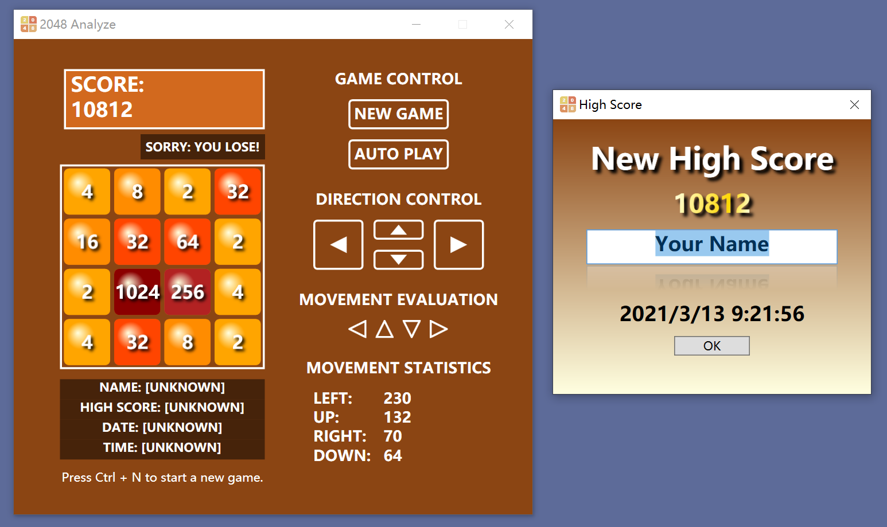

# wpf2048

*The 2048 Game using WPF - Merge adjacent cells with equal numbers to get the score as large as possible!*

Screenshot:

> Note: For the **auto play** mode, greedy algorithm is used. You can improve on that if you like :)
